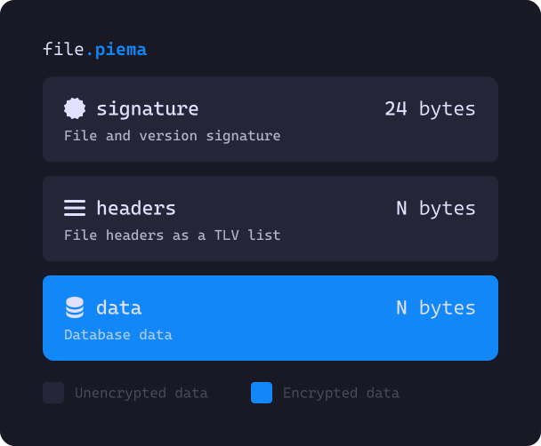
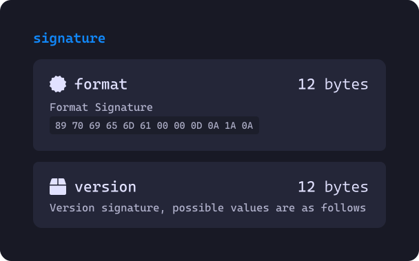
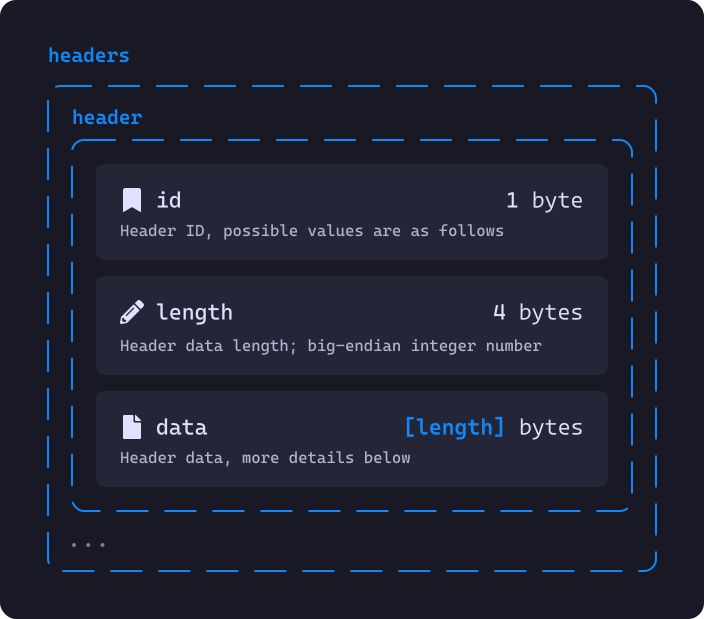
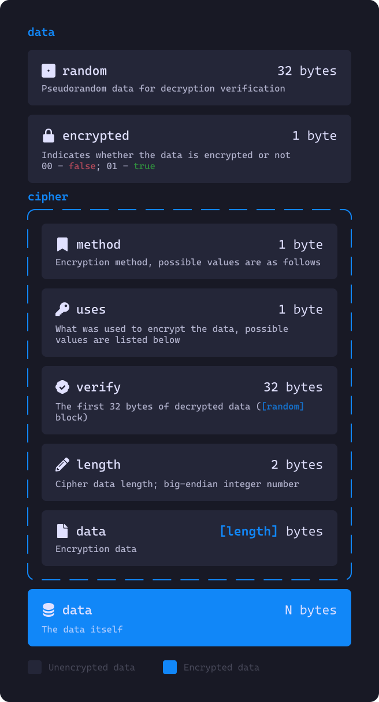
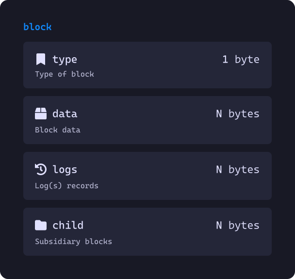
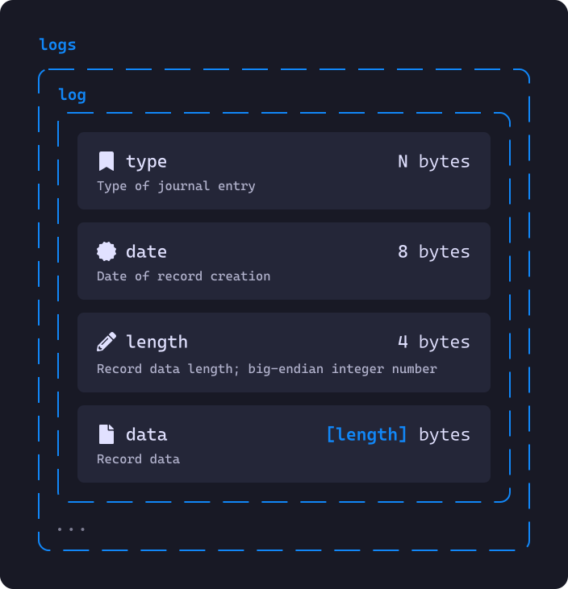
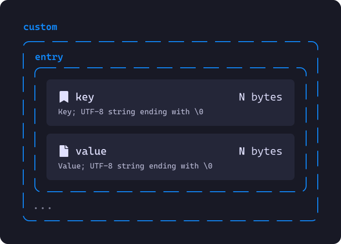
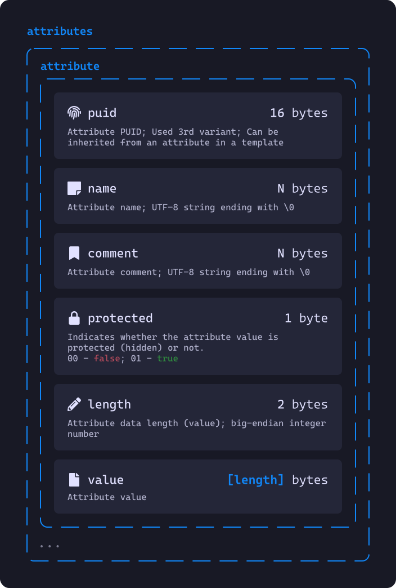
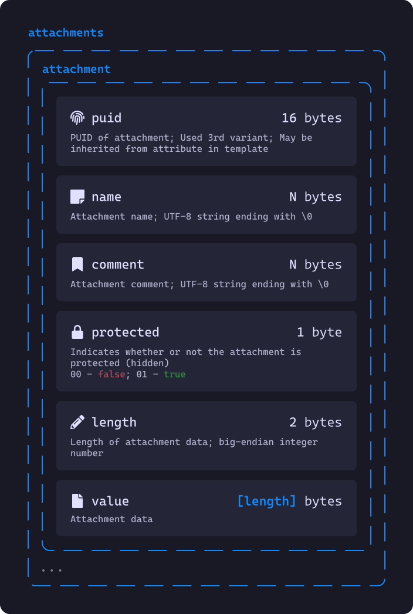

# Piema format specification
## Table of Contents
- [File structure](#file-structure)
	- [Signature](#signature)
	- [Headers](#headers)
	- [Data](#data)
- [Data processing](#data-processing)
	- [Logs (`logs`)](#logs-logs)
	- [Metadata](#metadata-01)
	- [Group](#group-02)
	- [Entry (Element, record)](#entry-element-record-03)
	- [Custom icon](#custom-icon-04)

## File structure


The `piema` file is divided into 3 blocks: signature (`signature`), headers (`headers`) and data (`data`). Each of the blocks is needed for different purposes.

### Signature


A signature consists of two parts: a file (or format) signature and a version signature. The file signature always has the value `89 70 69 65 6D 61 00 00 0D 0A 1A 0A`. The version signature has different values depending on the format version:

Version                                                      | Signature                             | Recommended
------------------------------------------------------------ | ------------------------------------- | -----------
*Past versions have been removed due to unfinished versions* |                                       |
**v2.1**                                                     | `77 1E C1 C0 2D AB F4 D3 D7 D3 8F 9A` | ✅

### Headers


The `piema` headers of a file are a TLV[^1] list. Headers can have the following types (`id`):

Header ID | Expected data length | Description                  | Mandatory
--------- | -------------------- | ---------------------------- | ---------
`00` (0)  | 0 byte               | Indicates the end of headers | ✅
`01` (1)  | ?                    | Database name                | ❌
`02` (2)  | 1 byte               | Data compression method      | ✅
`03` (3)  | 32 bytes             | SHA256 hash                  | ❌
`04` (4)  | 16 bytes             | Database PUID[^2]3[^5]       | ✅

#### Database name (`01`)
The value of this header is an `UTF-8` string. It is used to display at least some database name in the interface. The real name is specified in the encrypted metadata.

#### Data compression method (`02`)
This header indicates which compression method was used. Its value is this method:

Header value | Compression method
------------ | ------------
`00` (0)     | Uncompressed
`01` (1)     | GZip

#### SHA256 hash (`03`)
This header is needed to check the integrity of the data in the database. Its value is the SHA256 hash of all data [(`data` block)](#file-structure)

#### Database PUID (`04`)
The value of this header is time-based[^5] PUID[^2]. This header is needed to designate the database in some parts of the Piema project. For example, in protocols or access keys.

### Data


The first field occupies 32 bytes and is called `random`. It is needed to verify the decrypted data. If this is the first decryption cycle (time), it has the value of `00 00 00 00 00 00 00 00 00 00 00 00 00 00 00 00 00 00 00 00 00 00 00 00 00 00 00 00 00 00 00 00`.

Next is the `encrypted` field, which occupies 1 byte and indicates whether the following data is encrypted or not.
If this field is `00`, the data is not encrypted, and you can proceed to [**processing it.**](#data-processing)
If its value is `01`, then it is followed by the ciphertext data with which to decrypt it.

The next field, `cipher`, as mentioned earlier, indicates how the data is to be decrypted. Its first byte (`method`) indicates the method to be used:

`method` value | Description               | Recommended
-------------- | ------------------------- | -----------
`01` (1)       | `AES-256-CBC`             | ✅

The next byte (`uses`) indicates what was used as the key and can have the following values:

`uses` value | Description          | Receiving
------------ | -------------------- | ---------------------------
`00` (0)     | Master Password      | `sha3_256(master_password)`
`01` (1)     | Keyfile              | `sha3_256(keyfile.value)`
`02` (2)     | Physical key         | `sha3_256(hardware_key)`
`03` (3)     | Type 2 Piema USB key | `pusb_key.value`

The 32 bytes of the `verify` field are followed by the first 32 bytes of the decrypted data (`random`). They are needed to verify the correctness of the input data.

This is followed by 2 bytes of `length` - a `big-endian` integer number. This is the length of the downstream ciphertext data (`data`).

After decryption, we get the same set of bytes that need to be processed in exactly the same way.

###### AES-256-CBC
The data of this encryption method occupies 16 bytes. It (the data) is the value `IV` *(**I**nitialization **V**ector)*.

## Data processing
Before you can process the data you need to do the following:
1. Drop the first 33 bytes
2. Decompress the data according to the compression method [(header with ID `02`)](#метод-сжатия-данных-02)

After that we can start processing. The data we have left is a bunch of similar blocks:


Blocks can have the following types (`type`):

`type` field value | Description                                   | Contents
------------------ | --------------------------------------------- | -----------------------------------------
`00` (0)           | Indicates the end of child blocks/data blocks | —
`01` (1)           | Metadata                                      | *data (`data`)*, *child blocks (`child`)*
`02` (2)           | Group                                         | *data (`data`)*, *child blocks (`child`)*
`03` (3)           | Entry (Element)                               | *data (`data`)*
`04` (4)           | Custom icon **(metadata only)**               | *data (`data`)*

The length and content of the data (`data`) depends on the block type. Logs (`logs`) are a bunch of elements described below. And child blocks (`child`) are the same bunch of blocks.

### Logs (`logs`)


All logs start with an N byte type (`type`) - a UTF-8 string ending in `\x00`. The `end` value indicates the end of the log entries.
Possible values of this field can be viewed in [the following file](logs.md)

Next is 8 bytes of the date and time (`date`) of the log record creation. The value of this field is `Timestamp64`. 

This is followed by 4 bytes of data length (`length`), which is a big-endian integer number. This is followed by the record data (`data`) of `length` bytes.

### Metadata (`01`)
![block[metadata] data structure](images/block_metadata.svg)

Here it is better to describe types and lengths in the form of a table:

Field name       | Type          | Length, bytes | Method of storage           | Description
---------------- | ------------- | ------------- | --------------------------- | -----------------------------------------------------
**pass_cipher**  | `Enum`        | 1             | Below                       | Method of encryption of protected (hidden) attributes
**pass_data**    | `Bytes`       | 8             | Below                       | Encryption method data
**generator**    | `String`      |               | UTF-8 string + `\x00`       | Name of the database generator
**real_name**    | `String`      |               | UTF-8 string + `\x00`       | Real name of the database
**description**  | `String`      |               | UTF-8 string + `\x00`       | Description of database
**created**      | `Timestamp64` | 8             | Timestamp64                 | Date of database creation
**modified**     | `Timestamp64` | 8             | Timestamp64                 | Date and time of the last database modification
**logs_enabled** | `Boolean`     | 1             | `0` - `false`; `1` - `true` | Whether the log is enabled
**logs_climit**  | `UInt16`      | 2             | `UInt16`, `big-endian`      | Limit of the logs number at element; `0` - no limit
**logs_slimit**  | `UInt64`      | 8             | `UInt64`, `big-endian`      | Item's log size limit; `0` - no limit
**custom**       | `Dictionary`  |               | Below                       | Custom metadata

`pass_cipher` can have the following values:

Field value | Method         | `pass_data` value            | Recommended
----------- | -------------- |----------------------------- | -----------
`00` (0)    | No encryption  | `00 00 00 00 00 00 00 00`    | ❌
`01` (1)    | ARC4           | `00 00 00 00 00 00 00 00`    | 
`02` (2)    | Salsa20        | `IV` (Initialization Vector) | ✅

Either of these encryption methods uses the same key as the one used to decrypt the data as a key [(see above)](#data).

###### Storing custom metadata


Custom metadata is stored as key-value pairs. The `key` field comes first, followed by the `value` field. Both fields are UTF-8 strings ending in `\x00`. A key-value pair with an empty key (not including `\x00`) indicates the end of the dictionary.

### Group (`02`)
![block[group] data structure](images/block_group.svg)

Here it is better to describe types and lengths in the form of a table:

Field name    | Type          | Length, bytes | Method of storage                 | Description
------------- | ------------- | ------------- | --------------------------------- | ----------------------------------------
**puid**      | `PUID`        | 16            | PUID[^2]                          | Group PUID[^2]
**name**      | `String`      |               | UTF-8 string + `\x00`             | Name of group
**comment**   | `String`      |               | UTF-8 string + `\x00`             | Comment (description) to the group
**icon**      | `PUID`        | 16            | PUID[^2]                          | Group's icon PUID[^2]
**created**   | `Timestamp64` | 8             | Timestamp64                       | Date and time of group creation
**modified**  | `Timestamp64` | 8             | Timestamp64                       | Date and time of group modification
**expiry**    | `Timestamp64` | 8             | Timestamp64                       | Date and time of expiration of the group
**flags**     | `UInt64`      | 8             | UInt64                            | Group flags
**custom**    | `Dictionary`  |               | [Above](#storing-custom-metadata) | Custom metadata

The value of the `flags` field is calculated as follows:
```py
flags = flag1 | flag2  # flag1 = 1 << 1; flag2 = 1 << 2
```

The following flags exist:

Name              | Flag meaning   | Description
----------------- | -------------- | ------------------------------------------
`expiry`          | `1 << 1`       | The group has a limited lifespan
`search`          | `1 << 2`       | A search for this group is enabled
`inherits_search` | `1 << 3`       | The group inherits `search`
`out_of_sync`     | `1 << 5`       | This group doesn't need to be synchronized

### Entry (Element, record) (`03`)
![block[entry] data structure](images/block_entry.svg)

Here, it is better to describe types and lengths in a table:

Field name      | Type          | Length, bytes | Method of storage                 | Description
--------------- | ------------- | ------------- | --------------------------------- | --------------------------------------------------
**puid**        | `PUID`        | 16            | PUID[^2]                          | Entry PUID[^2]
**template**    | `PUID`        | 16            | PUID[^2]                          | Template-entry PUID[^2]
**name**        | `String`      |               | UTF-8 string + `\x00`             | The name of entry
**comment**     | `String`      |               | UTF-8 string + `\x00`             | Comment (description) on the entry
**icon**        | `PUID`        | 16            | PUID[^2]                          | Entry's icon PUID[^2]
**created**     | `Timestamp64` | 8             | Timestamp64                       | Date & time of entry creation
**modified**    | `Timestamp64` | 8             | Timestamp64                       | Date & time of entry modification
**expiry**      | `Timestamp64` | 8             | Timestamp64                       | Date & time of expiration of the entry
**flags**       | `UInt64`      | 8             | UInt64                            | Record flags
**background**  | `RGBA`        | 4             | red, green, blue, alpha channels  | Entry background color; `00 00 00 00` - unselected
**foreground**  | `RGBA`        | 4             | red, green, blue, alpha channels  | Entry foreground color; `00 00 00 00` - unselected
**tags**        | `String`      |               | UTF-8 string (`tag,...`) + `\x00` | Comma-separated entry tags
**attributes**  | `List[Attr]`  |               | Below                             | Attributes of the entry
**attachments** | `List[File]`  |               | Below                             | Attachments to the entry
**custom**      | `Dictionary`  |               | [Above](#storing-custom-metadata) | Custom metadata

The value of the `flags` field is calculated as follows:
```py
flags = flag1 | flag2  # flag1 = 1 << 1; flag2 = 1 << 3
```

The following flags are available:

Name          | Flag value | Description
------------- | ---------- | ------------------------------------------
`expiry`      | `1 << 1`   | The record has a limited lifespan
`out_of_sync` | `1 << 3`   | This entry doesn't need to be synchronized

###### Attributes


The first field of an attribute is PUID[^2], it inherits from the PUID[^2] of the same attribute in the template. An attribute with null[^4] PUID[^2] points to the end of the attribute list.

The second field is the name (`name`), a UTF-8 string ending in `\x00`. An empty value (not including `\x00`) means that the name should be inherited from the same attribute in the template.

The comment field (`comment`) is a UTF-8 string ending in `\x00`. An empty value (not including `\x00`) means that the comment should be inherited from the same attribute in the template.

Next is a boolean (`0` - `false`; `1` - `true`) field `protected` indicating whether the attribute data is protected. It can have the value `02`, then the value is inherited from the same attribute in the template.

The `length` field is followed by a `big-endian` integer number. It indicates the length of the attribute value.

The last field, `value`, has the length specified in the `length` field. If the value of the `protected` field is `0` (`00`), there is no need to decrypt the value additionally. If it has a value of `1` (`01`), then it must be decrypted first, according to the `pass_cipher` and `pass_data` from the metadata.

###### Attachments


Here, it is better to describe types and lengths in a table:

Field name    | Type          | Length, bytes | Method of storage           | Description
------------- | ------------- | ------------- | --------------------------- | --------------------------------------------
**puid**      | `PUID`        | 16            | PUID[^2]                    | Attachment of PUID[^2]
**name**      | `String`      |               | UTF-8 string + `\x00`       | Name of attachment
**comment**   | `String`      |               | UTF-8 string + `\x00`       | Comment to attachment
**protected** | `Boolean`     | 1             | `0` - `false`; `1` - `true` | Whether the attachment is protected (hidden)
**length**    | `UInt64`      | 8             | UInt64, `big-endian`        | Length of the attachment data
**data**      | `Bytes`       | **length**    | Attachment file content     | Data of the attachment

If the attachment is protected (`protected` = `1`), it should be decrypted in the same way as protected attributes:
> If the value of the `protected` field is `0` (`00`), there is no need to decrypt the data additionally. If it has a value of `1` (`01`), then it is necessary to decrypt them first, according to `pass_cipher` and `pass_data` from the metadata.

### Custom icon (`04`)
![block[custom_icon] data structure](images/block_custom_icon.svg)

Here, it is better to describe types and lengths in a table:

Field name   | Type          | Length, bytes | Method of storage                 | Description
------------ | ------------- | ------------- | --------------------------------- | ------------------------------------
**puid**     | `PUID`        | 16            | PUID[^2]                          | Icon of PUID[^2]
**name**     | `String`      |               | UTF-8 string + `\x00`             | Name of icon
**modified** | `Timestamp64` | 8             | Timestamp64                       | Date & time of the icon modification
**length**   | `UInt64`      | 8             | UInt64, `big-endian`              | Icon data length
**data**     | `Bytes`       | **length**    | Icon file content                 | Icon data
**custom**   | `Dictionary`  |               | [Above](#storing-custom-metadata) | Custom metadata

[^1]: TLV - **T**ype-**L**ength-**V**alue
[^2]: PUID - **P**iema **U**nique **Id**entifier
[^3]: PUID of recycle bin is `21000000-0000-0000-0000-000000000000`
[^4]: Null PUID is `20000000-0000-0000-0000-000000000000`
[^5]: [3rd PUID variant](/puid/en/README.md#time-based-variant-03)
