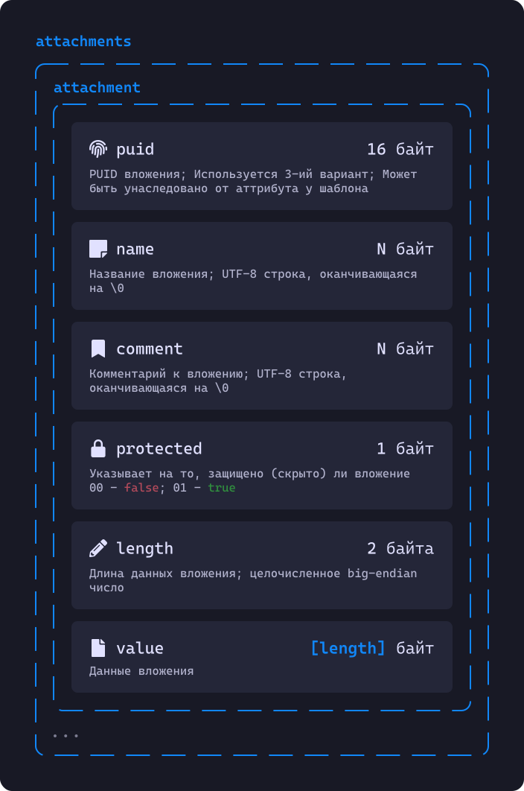

# Спецификация формата Piema
## Содержание
- [Структура файла](#структура-файла)
	- [Сигнатура](#сигнатура)
	- [Заголовки](#заголовки)
	- [Данные](#данные)
- [Обработка данных](#обработка-данных)
	- [Логи (`logs`)](#логи-logs)
	- [Метаданные](#метаданные-01)
	- [Группа](#группа-02)
	- [Сущность (Элемент, запись)](#сущность-элемент-запись-03)
	- [Кастомная иконка](#кастомная-иконка-04)

## Структура файла


Файл формата `piema` делится на 3 блока: сигнатура (`signature`), заголовки (`headers`) и данные (`data`). Каждый из блоков нужен для разных целей.

### Сигнатура


Сигнатура состоит из двух частей: сигнатура файла (или же формата) и сигнатура версии. Сигнатура файла всегда имеет значение `89 70 69 65 6D 61 00 00 0D 0A 1A 0A`. Сигнатура версии же имеет разные значения зависимо от версии формата:

Версия   | Сигнатура                             | Рекомендуется
-------- | ------------------------------------- | -------------
**v1.0** | `31 34 39 3A 34 32 30 3C 00 00 00 00` | ❌
**v2.0** | `88 A4 9C 7C D4 C0 90 84 D0 94 7C 84` | ✅

### Заголовки


Заголовки `piema` файла - это TLV-список[^1]. Заголовки могут иметь следующие типы (`id`):

ID заголовка | Ожидаемая длина данных | Описание                                   | Обязательно
------------ | ---------------------- | ------------------------------------------ | -----------
`00` (0)     | 0 байт                 | Указывает на конец заголовков              | ✅
`01` (1)     | ?                      | Название базы данных                       | ❌
`02` (2)     | 1 байт                 | Метод сжатия данных                        | ✅
`03` (3)     | 32 байта               | SHA256-хеш данных для проверки целостности | ❌
`04` (4)     | 1 байт                 | Пуста ли база данных                       | ❌

#### Название базы данных (`01`)
Значение этого заголовка - это `UTF-8` строка.

#### Метод сжатия данных (`02`)
Этот заголовок указывает на то, какой метод сжатия был использован. Его значение - и есть этот самый метод:

Значение заголовка | Метод сжатия
------------------ | ------------
`00` (0)           | Без сжатия
`01` (1)           | GZip

#### SHA256-хеш данных для проверки целостности (`03`)
Этот заголовок нужен для проверки целостности данных в базе данных. Его значение - это SHA256-хеш от всех данных [(блок `data`)](#структура-файла)

#### Пуста ли база данных (`04`)
Данный заголовок указывает на то, пуста ли база данных. Если это так, то он имеет значение `01`, в ином случае - `00`. Используется для игнорирования (полностью) пустых баз данных, т.к. они бесполезные.

### Данные


Первое поле занимает 32 байта и называется `random`. Оно нужно для проверки дешифрованных данных. Если это первый цикл (раз) дешифровки, то оно имеет значение `00 00 00 00 00 00 00 00 00 00 00 00 00 00 00 00 00 00 00 00 00 00 00 00 00 00 00 00 00 00 00 00`.

Далее идёт поле `encrypted`, занимающее 1 байт и указывающие на то, зашифрованы ли далее идущие данные.
Если это поле равно `00`, то данные не зашифрованы и можно переходить к [**их обработке.**](#обработка-данных)
Если же его значение равно `01`, то после идут данные шифровщика, с помощью которых нужно дешифровать их.

Следующее поле - `cipher`, как было сказано ранее, указывает на то, как надо дешифровать данные. Его первый байт (`method`) указывает на используемый метод:

Значение `method` | Описание                  | Рекомендуется
----------------- | ------------------------- | -------------
`01` (1)          | `AES-256-CBC`             | ✅

Следующий байт (`uses`) указывает на то, что было использовано в качестве ключа и может иметь следующие значения:

Значение `uses` | Описание                      | Получение
--------------- | ----------------------------- | ---------------------------
`00` (0)        | Мастер-пароль                 | `sha3_256(master_password)`
`01` (1)        | Ключ-файл                     | `sha3_256(keyfile.value)`
`02` (2)        | Физ. ключ                     | `sha3_256(hardware_key)`
`03` (3)        | 2-й тип USB-ключа Piema       | `pusb_key.value`

После идут 32 байта поля `verify` - это первые 32 байт дешифрованных данных (`random`). Они нужно для проверки правильности вводимых данных.

После идёт 2 байта длины (`length`) - целочисленное `big-endian` число. Это длина далее идущих данных шифровщика (`data`).

После дешифрования мы получаем такой же набор байт, который нужно обработать точно таким же образом.

###### AES-256-CBC
Данные этого метода шифрования занимают 16 байт. Они (данные) - это значение `IV` *(**I**nitialization **V**ector)*.

## Обработка данных
Перед тем, как обработать данные нужно сделать следующее:
1. Откинуть первые 33 байта
2. Разжать данные согласно методу сжатия [(заголовок с `02` ID)](#метод-сжатия-данных-02)

После можно приступать к обработке. Те данные, что у нас остались - это кучка подобных блоков:


Блоки могут иметь следующие типы (`type`):

Значение поля `type` | Описание                                   | Содержание
-------------------- | ------------------------------------------ | ---------------------------------------------
`00` (0)             | Указывает на конец дочерних блоков/данных  | —
`01` (1)             | Метаданные                                 | *данные (`data`)*, *дочерние блоки (`child`)*
`02` (2)             | Группа                                     | *данные (`data`)*, *дочерние блоки (`child`)*
`03` (3)             | Сущность (Элемент)                         | *данные (`data`)*
`04` (4)             | Кастомная иконка **(только в метаданных)** | *данные (`data`)*

Длина и содержание данных (`data`) зависит от типа блоков. Логи (`logs`) - это кучка элементов описанных ниже. А дочерние блоки (`child`) - это точно такая же кучка блоков.

### Логи (`logs`)


Все логи начинаются N байт типа (`type`) - UTF-8 строка, оканчивающаяся на `\x00`. Значение `end` указывает на конец записей журнала.
Возможные значения этого поля можно посмотреть в [следующем файле](logs.md)

Далее идёт 8 байт даты и времени (`date`) создания записи журнала. Значение этого поля - это `Timestamp64`. 

После идут 4 байта длины (`length`) данных - целочисленное `big-endian` число. После идут данные записи (`data`) длиною в `length` байт.

### Метаданные (`01`)
![block[metadata] data structure](images/block_metadata.svg)

Тут лучше описать типы и длины в виде таблицы:

Название поля    | Тип           | Длина, байты | Метод хранения              | Описание
---------------- | ------------- | ------------ | --------------------------- | --------------------------------------------------------
**pass_cipher**  | `Enum`        | 1            | Ниже                        | Метод шифрования защищённых (скрытых) аттрибутов
**pass_data**    | `Bytes`       | 8            | Ниже                        | Данные метода шифрования
**generator**    | `String`      |              | UTF-8 строка + `\x00`       | Название генератора базы данных
**real_name**    | `String`      |              | UTF-8 строка + `\x00`       | Реальное название базы данных
**description**  | `String`      |              | UTF-8 строка + `\x00`       | Описание базы данных
**created**      | `Timestamp64` | 8            | Timestamp64                 | Дата создания базы данных
**modified**     | `Timestamp64` | 8            | Timestamp64                 | Дата и время последнего изменения базы данных
**logs_enabled** | `Boolean`     | 1            | `0` - `false`; `1` - `true` | Включен ли журнал
**logs_climit**  | `UInt16`      | 2            | `UInt16`, `big-endian`      | Лимит количества логов у элемента; `0` - нет лимита
**logs_slimit**  | `UInt64`      | 8            | `UInt64`, `big-endian`      | Лимит размера логов у элемента; `0` - нет лимита
**recyle_bin**   | `UUID`        | 16           | UUID                        | UUID[^2][^3] группы корзины, если её нет, то нулевой[^4]
**custom**       | `Dictionary`  |              | Ниже                        | Кастомные метаданные

`pass_cipher` может иметь следующие значение:

Значение поля | Метод          | Значение `pass_data`         | Рекомендуется
------------- | -------------- |----------------------------- | -------------
`00` (0)      | Без шифрования | `00 00 00 00 00 00 00 00`    | ❌
`01` (1)      | ARC4           | `00 00 00 00 00 00 00 00`    | 
`02` (2)      | Salsa20        | `IV` (Initialization Vector) | ✅

В качестве ключа у любого из этих методов шифрования используется тот же ключ, что и для дешифровки данных [(см. выше)](#данные).

###### Хранение кастомных метаданных


Кастомные метаданные хранятся как пары ключ-значение. Сначала идёт поле ключ `key`, после поле `value`. Оба поля - это UTF-8 строки, оканчивающиеся на `\x00`. Пара ключ-значение с пустым ключом (не учитывая `\x00`) указывает на конец словаря.

### Группа (`02`)
![block[group] data structure](images/block_group.svg)

Тут лучше описать типы и длины в виде таблицы:

Название поля | Тип           | Длина, байты | Метод хранения                         | Описание
------------- | ------------- | ------------ | -------------------------------------- | --------------------------------------------
**uuid**      | `UUID`        | 16           | UUID[^2]                               | UUID[^2] группы
**name**      | `String`      |              | UTF-8 строка + `\x00`                  | Название группы
**comment**   | `String`      |              | UTF-8 строка + `\x00`                  | Комментарий (описание) к группе
**icon**      | `UUID`        | 16           | UUID[^2]                               | UUID[^2] иконки группы
**created**   | `Timestamp64` | 8            | Timestamp64                            | Дата и время создания группы
**modified**  | `Timestamp64` | 8            | Timestamp64                            | Дата и время изменения группы
**expiry**    | `Timestamp64` | 8            | Timestamp64                            | Дата и время истечение срока действия группы
**flags**     | `UInt64`      | 8            | UInt64                                 | Флаги группы
**custom**    | `Dictionary`  |              | [Выше](#хранение-кастомных-метаданных) | Кастомные метаданные

Значение поля `flags` высчитывается следующим образом:
```py
flags = flag1 | flag2  # flag1 = 1 << 1; flag2 = 1 << 2
```

Существуют следующие флаги:

Название          | Значение флага | Описание
----------------- | -------------- | -----------------------------------------
`expiry`          | `1 << 1`       | У группы ограниченное время существования
`search`          | `1 << 2`       | Включён поиск по этой группе
`inherits_search` | `1 << 3`       | Группа наследует `search`
`templates`       | `1 << 4`       | Эта группа содержит в себе шаблоны
`out_of_sync`     | `1 << 5`       | Эту группу не нужно синхронизировать

### Сущность (Элемент, запись) (`03`)
![block[entry] data structure](images/block_entry.svg)

Тут лучше описать типы и длины в виде таблицы:

Название поля   | Тип           | Длина, байты | Метод хранения                         | Описание
--------------- | ------------- | ------------ | -------------------------------------- | ----------------------------------------------
**uuid**        | `UUID`        | 16           | UUID[^2]                               | UUID[^2] записи
**template**    | `UUID`        | 16           | UUID[^2]                               | UUID[^2] записи-шаблона
**name**        | `String`      |              | UTF-8 строка + `\x00`                  | Название записи
**comment**     | `String`      |              | UTF-8 строка + `\x00`                  | Комментарий (описание) к записи
**icon**        | `UUID`        | 16           | UUID[^2]                               | [^2] иконки записи
**created**     | `Timestamp64` | 8            | Timestamp64                            | Дата и время создания записи
**modified**    | `Timestamp64` | 8            | Timestamp64                            | Дата и время изменения записи
**expiry**      | `Timestamp64` | 8            | Timestamp64                            | Дата и время истечение срока действия записи
**flags**       | `UInt64`      | 8            | UInt64                                 | Флаги записи
**background**  | `RGBA`        | 4            | красный, зелёный, синий, альфа каналы  | Цвет фона записи; `00 00 00 00` - не выбрано
**foreground**  | `RGBA`        | 4            | красный, зелёный, синий, альфа каналы  | Цвет текста записи; `00 00 00 00` - не выбрано
**tags**        | `String`      |              | UTF-8 строка (`tag,tag2,...`) + `\x00` | Разделённые запятыми теги записи
**attributes**  | `List[Attr]`  |              | Ниже                                   | Атрибуты записи
**attachments** | `List[File]`  |              | Ниже                                   | Вложения к записи
**custom**      | `Dictionary`  |              | [Выше](#хранение-кастомных-метаданных) | Кастомные метаданные

Значение поля `flags` высчитывается следующим образом:
```py
flags = flag1 | flag2  # flag1 = 1 << 1; flag2 = 1 << 2
```

Существуют следующие флаги:

Название          | Значение флага | Описание
----------------- | -------------- | -------------------------------------------------------------
`expiry`          | `1 << 1`       | У записи ограниченное время существования
`template`        | `1 << 2`       | Эта запись - шаблон, может наследоваться того же флага группы
`out_of_sync`     | `1 << 3`       | Эту запись не нужно синхронизировать

###### Атрибуты


Первое поле атрибута - это UUID[^2], оно наследуется от UUID[^2] того же атрибута у шаблона. Атрибут с UUID[^2] `00000000-0000-0000-0000-000000000000` указывает на конец списка атрибутов. 

Второе поле - это название (`name`) - UTF-8 строка, оканчивающаяся на `\x00`. Пустое значение (не учитывая `\x00`) обозначает, что название нужно наследовать от того же атрибута у шаблона.

После идёт поле комментария (`comment`) - UTF-8 строка, оканчивающаяся на `\x00`. Пустое значение (не учитывая `\x00`) обозначает, что комментарий нужно наследовать от того же атрибута у шаблона.

Далее идёт логическое (`0` - `false`; `1` - `true`) поле `protected`, указывающие на то, защищены ли данные атрибута. Может иметь значение `02`, тогда значение наследуется от того же атрибута у шаблона.

После идёт поле длины (`length`) - целочисленное `big-endian` число. Оно указывает на длину значение атрибута.

Последнее поле - `value` - имеет длину, указанную в поле `length`. Если значение поля `protected` - это `0` (`00`), то дополнительно дешифровать значение не нужно. Если же оно имеет значение `1` (`01`), то сначала нужно дешифровать его, согласно `pass_cipher` и `pass_data` из метаданных.

###### Вложения


Тут лучше описать типы и длины в виде таблицы:

Название поля   | Тип           | Длина, байты | Метод хранения              | Описание
--------------- | ------------- | ------------ | --------------------------- | -----------------------------
**uuid**        | `UUID`        | 16           | UUID[^2]                    | UUID[^2] вложения
**name**        | `String`      |              | UTF-8 строка + `\x00`       | Название вложения
**comment**     | `String`      |              | UTF-8 строка + `\x00`       | Комментарий к вложению
**protected**   | `Boolean`     | 1            | `0` - `false`; `1` - `true` | Защищено (скрыто) ли вложение
**length**      | `UInt64`      | 8            | UInt64, `big-endian`        | Длина данных вложения
**data**        | `Bytes`       | **length**   | Содержимое файла иконки     | Данные вложения

Если вложение защищено (`protected` = `1`), то его нужно дешифровать точно так же как и защищённые атрибуты:
> Если значение поля `protected` - это `0` (`00`), то дополнительно дешифровать данные не нужно. Если же оно имеет значение `1` (`01`), то сначала нужно дешифровать их, согласно  `pass_cipher` и `pass_data` из метаданных.

### Кастомная иконка (`04`)
![block[custom_icon] data structure](images/block_custom_icon.svg)

Тут лучше описать типы и длины в виде таблицы:

Название поля   | Тип           | Длина, байты | Метод хранения                         | Описание
--------------- | ------------- | ------------ | -------------------------------------- | -----------------------------
**uuid**        | `UUID`        | 16           | UUID[^2]                               | UUID[^2] иконки
**name**        | `String`      |              | UTF-8 строка + `\x00`                  | Название иконки
**modified**    | `Timestamp64` | 8            | Timestamp64                            | Дата и время изменения иконки
**length**      | `UInt64`      | 8            | UInt64, `big-endian`                   | Длина данных иконки
**data**        | `Bytes`       | **length**   | Содержимое файла иконки                | Данные иконки
**custom**      | `Dictionary`  |              | [Выше](#хранение-кастомных-метаданных) | Кастомные метаданные

[^1]: TLV *(**англ.** **T**ype-**L**ength-**V**alue)* - Тип-Длина-Значение
[^2]: UUID 4-ой версии или 1 из [зарезервированных UUID](uuid.md)
[^3]: UUID корзины - `706965ce-0002-0000-0000-000000000000`
[^4]: Нулевой UUID - это `00000000-0000-0000-0000-000000000000`
