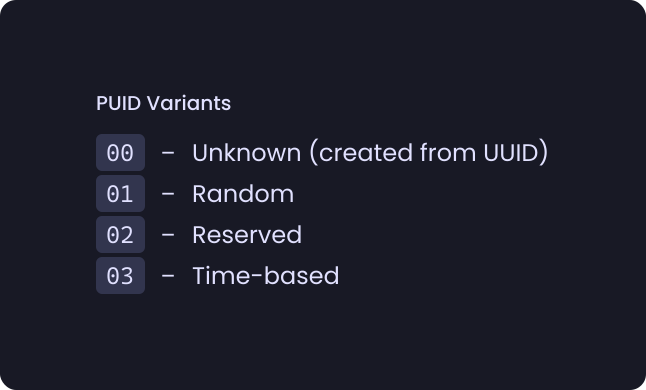

# PUID[^1]
## Table of Contents
- [Structure](#structure)
  - [Variants](#variants)
  - [Categories](#categories)
- [The list of reserved PUIDs](#the-list-of-reserved-puids)

## Structure
All PUIDs consist of two parts: the first byte is the metadata and the next 15 bytes are the data itself.

The first byte is made up of the [variant](#variants) and [category](#categories):
```py
# variant and category - number between 0 and 15
metadata = variant << 4 | category
```

And the whole PUID is made up like this:
```py
# metadata compiled earlier
puid = metadata.to_bytes(1, "big")

# value - PUID value (15 bytes)
puid += value
```

### Variants


#### "Unknown" variant (`00`)
> <br>
> `V` - variant (`0`); `x` - the part (4 bits) of value

The value of the PUID of this variant is a complete copy of the value of the UUID from which the PUID was formed. Instead of a category, this variant has 4 more data bits (otherwise the UUID of the 4th variant would not fit)

#### "Random" variant (`01`)
> <br>
> `V` - variant (`1`); `C` - [category](#categories); `x` - the part (4 bits) of value

This PUID has a value of 15 random bytes

#### "Reversed" variant (`02`)
> <br>
> `V` - variant (`2`); `C` - [category](#categories); `x` - the part (4 bits) of value

The value of the reserved PUID is a sequence number from `0` to `2¹²⁰-1`

#### Time-based variant (`03`)
> <br>
> `V` - variant (`2`); `C` - [category](#categories); `t` - the part (4 bits) of PUID creation time; `x` - the part (4 bits) of random value

The first 8 bytes of the value are the time in timestamp64 format. The next 7 bytes are a random number from `0` to `2⁵⁶-1`.

### Categories


## The list of reserved PUIDs
PUID                                   | Type               | Description/Preview
-------------------------------------- | ------------------ | ------------------------------------------------------------
`20000000-0000-0000-0000-000000000000` |                    | Points to the end in lists where the key is a PUID
`21000000-0000-0000-0000-000000000000` | Group              | Recycle bin
`21000000-0000-0000-0000-000000000001` | Group              | Template group
`23000000-0000-0000-0000-000000000000` | Default icon       | 
`23000000-0000-0000-0000-000000000001` | Default icon       | 
`23000000-0000-0000-0000-000000000002` | Default icon       | 
`23000000-0000-0000-0000-000000000003` | Default icon       | 
`23000000-0000-0000-0000-000000000000` | Default icon       | 
`23000000-0000-0000-0000-000000000005` | Default icon       | 
`23000000-0000-0000-0000-000000000006` | Default icon       | 
`23000000-0000-0000-0000-000000000007` | Default icon       | 
`23000000-0000-0000-0000-000000000008` | Default icon       | 
`23000000-0000-0000-0000-000000000009` | Default icon       | 
`23000000-0000-0000-0000-00000000000A` | Default icon       | 
`23000000-0000-0000-0000-00000000000B` | Default icon       | 
`23000000-0000-0000-0000-00000000000C` | Default icon       | 
`23000000-0000-0000-0000-00000000000D` | Default icon       | 
`23000000-0000-0000-0000-00000000000E` | Default icon       | 
`23000000-0000-0000-0000-00000000000F` | Default icon       | 
`23000000-0000-0000-0000-000000000010` | Default icon       | 
`23000000-0000-0000-0000-000000000011` | Default icon       | 
`23000000-0000-0000-0000-000000000012` | Default icon       | 
`23000000-0000-0000-0000-000000000013` | Default icon       | 
`23000000-0000-0000-0000-000000000014` | Default icon       | 
`23000000-0000-0000-0000-000000000015` | Default icon       | 
`23000000-0000-0000-0000-000000000016` | Default icon       | 
`23000000-0000-0000-0000-000000000017` | Default icon       | 
`23000000-0000-0000-0000-000000000018` | Default icon       | 
`23000000-0000-0000-0000-000000000019` | Default icon       | 
`23000000-0000-0000-0000-00000000001A` | Default icon       | 
`23000000-0000-0000-0000-00000000001B` | Default icon       | 
`23000000-0000-0000-0000-00000000001C` | Default icon       | 
`23000000-0000-0000-0000-00000000001D` | Default icon       | 
`23000000-0000-0000-0000-00000000001E` | Default icon       | 
`23000000-0000-0000-0000-00000000001F` | Default icon       | 
`23000000-0000-0000-0000-000000000020` | Default icon       | 
`23000000-0000-0000-0000-000000000021` | Default icon       | 

[^1]: PUID - **P**iema **U**nique **Id**entifier - A little (a lot) redesigned UUID
