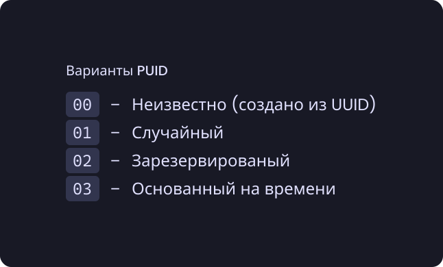
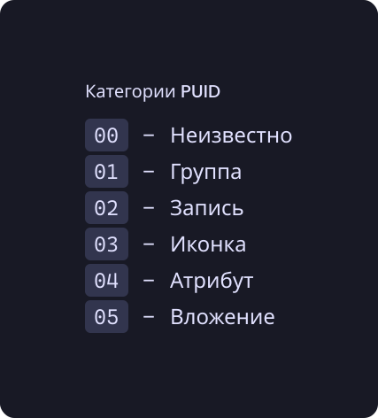

# PUID[^1]
## Содержание
- [Структура](#структура)
  - [Варианты](#варианты)
  - [Категории](#категории)
- [Список зарезервированных PUID](#список-зарезервированных-puid)

## Структура
Все PUID состоят из двух частей: первый байт - метаданные, а следующие 15 байт - сами данные.

Первый байт составляется из [варианта](#варианты) и [категории](#категории):
```py
# variant и category - число от 0 до 15
metadata = variant << 4 | category
```

А весь PUID составляется так:
```py
# metadata составленный ранее
puid = metadata.to_bytes(1, "big")

# value - значение PUID (15 байт)
puid += value
```

### Варианты


#### "Неизвестный" вариант (`00`)
> <br>
> `V` - вариант (`0`); `x` - часть (4 бита) значения

Значение у PUID этого варианта - это полная копия значения UUID, из которого сформирован PUID. Вместо категории у этого варианта ещё 4 бита данных (иначе UUID 4-го варианта не помещается).

#### "Случайный" вариант (`01`)
> <br>
> `V` - вариант (`1`); `C` - [категория](#категории); `x` - часть (4 бита) значения

У этого PUID значением являются 15 случайных байт.

#### "Зарезервированный" вариант (`02`)
> <br>
> `V` - вариант (`2`); `C` - [категория](#категории); `x` - часть (4 бита) значения

Значением зарезервированного PUID - это порядковый номер от `0` до `2¹²⁰-1`.

#### Основанный на времени вариант (`03`)
> <br>
> `V` - вариант (`2`); `C` - [категория](#категории); `t` - часть (4 бита) времени создания PUID; `x` - часть (4 бита) случайного значения

Первые 8 байт значения - это время в формате timestamp64. А следующие 7 байт - это случайное число от `0` до `2⁵⁶-1`.

### Категории


## Список зарезервированных PUID
PUID                                   | Тип                | Описание/Предпросмотр
-------------------------------------- | ------------------ | ------------------------------------------------------------
`20000000-0000-0000-0000-000000000000` |                    | Указывает на конец в списках, где ключ - это PUID
`21000000-0000-0000-0000-000000000000` | Группа             | Корзина
`21000000-0000-0000-0000-000000000001` | Группа             | Группа с шаблонами
`23000000-0000-0000-0000-000000000000` | Стандартная иконка | 
`23000000-0000-0000-0000-000000000001` | Стандартная иконка | 
`23000000-0000-0000-0000-000000000002` | Стандартная иконка | 
`23000000-0000-0000-0000-000000000003` | Стандартная иконка | 
`23000000-0000-0000-0000-000000000000` | Стандартная иконка | 
`23000000-0000-0000-0000-000000000005` | Стандартная иконка | 
`23000000-0000-0000-0000-000000000006` | Стандартная иконка | 
`23000000-0000-0000-0000-000000000007` | Стандартная иконка | 
`23000000-0000-0000-0000-000000000008` | Стандартная иконка | 
`23000000-0000-0000-0000-000000000009` | Стандартная иконка | 
`23000000-0000-0000-0000-00000000000A` | Стандартная иконка | 
`23000000-0000-0000-0000-00000000000B` | Стандартная иконка | 
`23000000-0000-0000-0000-00000000000C` | Стандартная иконка | 
`23000000-0000-0000-0000-00000000000D` | Стандартная иконка | 
`23000000-0000-0000-0000-00000000000E` | Стандартная иконка | 
`23000000-0000-0000-0000-00000000000F` | Стандартная иконка | 
`23000000-0000-0000-0000-000000000010` | Стандартная иконка | 
`23000000-0000-0000-0000-000000000011` | Стандартная иконка | 
`23000000-0000-0000-0000-000000000012` | Стандартная иконка | 
`23000000-0000-0000-0000-000000000013` | Стандартная иконка | 
`23000000-0000-0000-0000-000000000014` | Стандартная иконка | 
`23000000-0000-0000-0000-000000000015` | Стандартная иконка | 
`23000000-0000-0000-0000-000000000016` | Стандартная иконка | 
`23000000-0000-0000-0000-000000000017` | Стандартная иконка | 
`23000000-0000-0000-0000-000000000018` | Стандартная иконка | 
`23000000-0000-0000-0000-000000000019` | Стандартная иконка | 
`23000000-0000-0000-0000-00000000001A` | Стандартная иконка | 
`23000000-0000-0000-0000-00000000001B` | Стандартная иконка | 
`23000000-0000-0000-0000-00000000001C` | Стандартная иконка | 
`23000000-0000-0000-0000-00000000001D` | Стандартная иконка | 
`23000000-0000-0000-0000-00000000001E` | Стандартная иконка | 
`23000000-0000-0000-0000-00000000001F` | Стандартная иконка | 
`23000000-0000-0000-0000-000000000020` | Стандартная иконка | 
`23000000-0000-0000-0000-000000000021` | Стандартная иконка | 

[^1]: PUID - **P**iema **U**nique **Id**entifier *(**рус.** Уникальный идентификатор Piema)* - Немного (много) переделанный UUID
